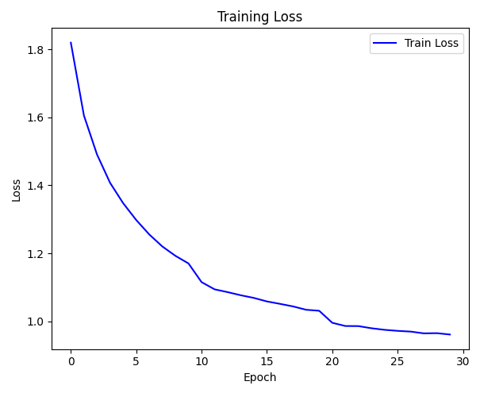
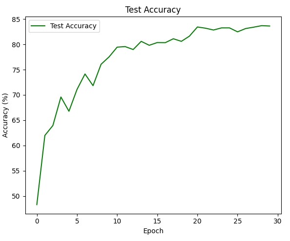
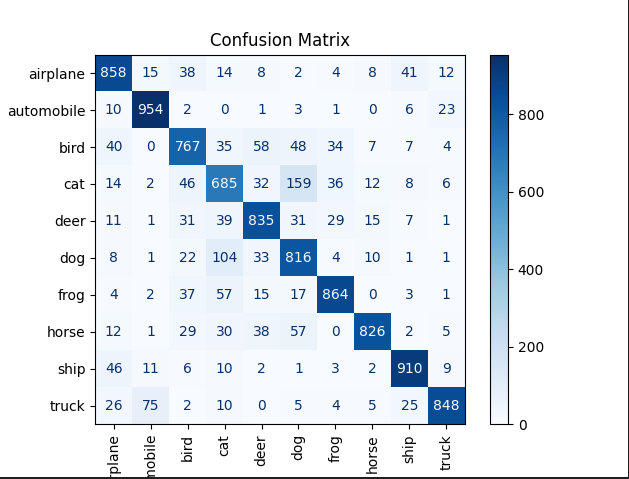

# CIFAR-10 Image Classification using CNN (PyTorch)

## Problem Statement

The goal is to **classify images into one of 10 categories** (e.g., airplane, car, bird...) from the CIFAR-10 dataset.  
Each image is a **32x32 RGB image**, and there are 60,000 images in total (50k train + 10k test).

This is a **multiclass image classification** task, and we build a **Convolutional Neural Network (CNN)** from scratch using **PyTorch**.

---

## Solution Overview

This implementation leverages **PyTorch** for model building and training. It includes data augmentations, CNN architecture with dropout & batch normalization, a custom training loop, evaluation metrics, and visualization.

> **Note**: Unlike tree-based models (like XGBoost), image data needs specialized models like CNNs, and hence **deep learning frameworks like PyTorch are essential**.

---

## Technologies Used

### **TorchVision + PyTorch**
> **For data, model, training, and evaluation**

- `torchvision.datasets` – Fetches the CIFAR-10 dataset  
- `torchvision.transforms` – Applies data augmentations (random crops, flips, normalization)  
- `torch.nn` – Defines CNN layers and loss functions  
- `torch.optim` – Handles optimizer and learning rate scheduling  
- `torch.utils.data.DataLoader` – Loads data in mini-batches  

---

### **Scikit-learn**
> **For evaluation and reporting**

- `confusion_matrix`, `classification_report` – Evaluate per-class accuracy, precision, recall, and F1-score  
- `ConfusionMatrixDisplay` – Visual representation of misclassifications  

---

### **Matplotlib**
> **For plotting loss and accuracy curves**

---

## Training Pipeline

### 🔹 Step 1: Data Preparation

- Download CIFAR-10 train/test datasets
- Apply augmentations on training data:
  - Random cropping with padding
  - Horizontal flip
  - Color jitter
- Normalize all data to range `[-1, 1]`

### 🔹 Step 2: CNN Model

- **3 Convolutional Blocks** with:
  - Conv → BatchNorm → ReLU → MaxPool  
  - Feature channels: 3 → 32 → 64 → 128
- **Fully Connected Layers**:
  - FC(2048) → 256 → 10 (logits)
- Dropout regularization before FC layer

### 🔹 Step 3: Training

- Loss Function: `CrossEntropyLoss` with `label_smoothing=0.1`
- Optimizer: `SGD` with momentum and weight decay
- Scheduler: Step decay (LR drops every 10 epochs)
- Trained for 30 epochs

### 🔹 Step 4: Evaluation

- Compute **test accuracy** after every epoch  
- At end of training:
  - Show **loss curve**, **accuracy curve**
  - Display **confusion matrix**
  - Print **classification report**

---

## 📈 Sample Output

### Sample Output

```
Epoch 1/30 | Loss: 1.6243 | Test Accuracy: 53.12%
Epoch 10/30 | Loss: 0.9241 | Test Accuracy: 71.45%
Epoch 20/30 | Loss: 0.6725 | Test Accuracy: 78.63%
Epoch 30/30 | Loss: 0.5482 | Test Accuracy: 81.27%
```

### Classification Report

```
              precision    recall  f1-score   support

    airplane       0.84      0.88      0.86       100
  automobile       0.90      0.89      0.90       100
        bird       0.76      0.70      0.73       100
         cat       0.70      0.65      0.67       100
        deer       0.80      0.81      0.81       100
         dog       0.71      0.70      0.70       100
        frog       0.86      0.88      0.87       100
       horse       0.89      0.90      0.90       100
        ship       0.89      0.92      0.90       100
       truck       0.85      0.86      0.85       100

    accuracy                           0.83      1000
   macro avg       0.82      0.82      0.82      1000
weighted avg       0.82      0.83      0.82      1000
```

### Training Loss Graph



### Test Accuracy Graph



### Confusion Matrix



---

## Why Use CNNs for CIFAR-10?

| Reason                   | Benefit                                                                 |
|--------------------------|-------------------------------------------------------------------------|
| **Spatial Hierarchies**  | CNNs capture local patterns like edges and textures                     |
| **Parameter Sharing**    | Fewer parameters compared to fully-connected layers                     |
| **Translation Invariance**| Pooling and convolutions make predictions invariant to small shifts    |
| **Efficient Training**   | BatchNorm, Dropout and ReLU speed up convergence and generalization     |

---

## Why Not Use Tabular Models?

| Issue                   | Why CNNs Work Better                                                     |
|-------------------------|--------------------------------------------------------------------------|
| Pixel structure ignored | Tabular models flatten the image and ignore spatial relationships       |
| Curse of dimensionality | 32×32×3 = 3072 features — hard for tree-based models to interpret        |
| No feature engineering  | CNNs learn patterns without needing hand-crafted pixel combinations     |

---

## Output Artifacts

- Trained PyTorch model 
- Loss/accuracy plots
- Confusion matrix
- Classification metrics


